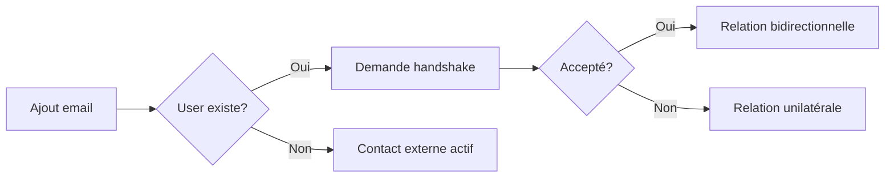

# Form-a-Friend - Spécifications Complètes

## 📋 Table des matières
1. [Vision & Concept](#vision--concept)
2. [Acteurs & Rôles](#acteurs--rôles)
3. [Fonctionnalités Clés](#fonctionnalités-clés)
4. [Flux Détaillés](#flux-détaillés)
5. [Règles Métier](#règles-métier)
6. [Sécurité & Confidentialité](#sécurité--confidentialité)
7. [Infrastructure Technique](#infrastructure-technique)
8. [Configuration Requise](#configuration-requise)

---

## 🎯 Vision & Concept

### Principe Fondamental
Form-a-Friend est un **rituel mensuel privé et interactif** permettant de maintenir des liens forts entre amis à travers un formulaire unique partagé.

### Concepts Clés

#### 1. **Une Soumission Réutilisée**
- Chaque utilisateur remplit **UNE SEULE FOIS** le formulaire par mois
- Cette soumission unique est **automatiquement réutilisée** dans toutes les vues 1-vs-1
- Pas de duplication, pas de remplissage multiple

#### 2. **Système Symétrique**
- **TOUT LE MONDE** a un compte avec dashboard complet
- Chaque utilisateur gère sa propre liste de contacts
- Chaque utilisateur envoie SON formulaire à SES contacts
- Chaque utilisateur reçoit les réponses de SES contacts uniquement

#### 3. **Relations 1-vs-1 Privées**
- Confidentialité stricte : seules 2 personnes voient leurs échanges
- Pas de visibilité croisée entre contacts
- Système de handshake pour relations mutuelles entre comptes

---

## 👥 Acteurs & Rôles

### 1. Utilisateur avec Compte
**Capacités complètes** :
- Dashboard personnel complet
- Gestion de ses contacts
- Envois mensuels automatiques
- Consultation des réponses (globale / par contact / 1-vs-1)
- Paramètres personnalisés

### 2. Contact avec Compte
**Deux cas possibles** :
- **Handshake accepté** : Relation bidirectionnelle active, visibilité mutuelle
- **Sans handshake** : Peut recevoir le formulaire mais pas de visibilité retour

### 3. Contact sans Compte
**Accès limité** :
- Reçoit un lien privé (token) par email
- Accède uniquement à la vue 1-vs-1 avec l'expéditeur
- Peut créer un compte pour obtenir un dashboard complet
- Historique conservé après création du compte

---

## ✨ Fonctionnalités Clés

### 1. Dashboard Personnel (pour tous les users)

#### Vue d'ensemble
- **Rituel du mois** : Formulaire actuel, statut (répondu/à remplir), deadline
- **Résumé du mois** : Taux de réponse, contacts à relancer, statistiques
- **Notifications** : Handshakes en attente, nouvelles réponses

#### Gestion des Contacts
- **Liste complète** avec statuts visuels (actif, en attente, sans réponse)
- **Ajout unitaire** par email
- **Import CSV** avec mapping colonnes
- **Tags** pour organisation
- **Tracking** : dernière interaction, taux de réponse

#### Consultation des Réponses
- **Vue globale** : Toutes les réponses du mois en un fil
- **Timeline par contact** : Historique mois par mois
- **Vue 1-vs-1 complète** : Formulaire côte à côte (contact ↔ toi)

### 2. Formulaire Mensuel

#### Structure (identique chaque mois)
- **5 questions texte** prédéfinies
- **5 questions photo** avec légendes optionnelles
- **1 champ libre** (max 5000 caractères)

#### Caractéristiques
- Mobile-first avec progression visuelle
- Autosauvegarde toutes les 30 secondes
- Compression photos côté client
- Validation en temps réel

### 3. Système de Handshake

#### Pour relations entre comptes
1. Alice ajoute Bob (qui a un compte) → Demande de handshake envoyée
2. Bob accepte → Relation bidirectionnelle active
3. Bob refuse/ignore → Alice peut garder Bob mais pas de réciprocité

#### Règles
- Requis pour visibilité mutuelle entre comptes
- Non requis pour envoyer le formulaire
- Peut être révoqué (block)

### 4. Invitations & Tokens

#### Invitation mensuelle
- Token unique par invitation (pas par user)
- Expiration 60 jours
- Tracking : envoi, ouverture, début, soumission
- Code de vérification optionnel (anti-transfert)

#### Email personnalisé
- From : "Alice via Form-a-Friend"
- Reply-To : alice@email.com
- Lien direct vers formulaire pré-rempli

---

## 🔄 Flux Détaillés

### 1. Ajout de Contacts



#### Process
1. **Saisie email** (+ prénom optionnel)
2. **Vérification doublon** → Merge si existant
3. **Si compte existe** → Proposition handshake automatique
4. **Si pas de compte** → Contact externe, invitation par token

### 2. Cycle Mensuel

#### Automatisation (le 5 à 18h Paris)
1. **Activation du cycle** pour le mois
2. **Pour chaque utilisateur actif** :
   - Génération des invitations pour ses contacts actifs
   - Envoi selon préférences horaires
3. **Relances automatiques** :
   - J+3 : Rappel doux (si pas ouvert ou pas soumis)
   - J+7 : Dernière chance (si toujours pas soumis)

### 3. Soumission du Formulaire

#### User avec compte
1. Remplit UNE FOIS le formulaire du mois
2. Soumission stockée centralement
3. Automatiquement visible dans toutes ses relations 1-vs-1

#### Contact sans compte
1. Accède via lien token
2. Remplit le formulaire
3. Voit immédiatement la vue 1-vs-1
4. Option "Créer mon espace" pour conversion

### 4. Consultation des Réponses

#### Dashboard (users avec compte)
- **Mes contacts** → Liste des réponses reçues
- **Clic sur contact** → Timeline ou vue 1-vs-1
- **Filtres** : Par mois, par tag, par statut

#### Vue 1-vs-1 (tous)
- **Colonne gauche** : Réponses du contact
- **Colonne droite** : Mes réponses
- **Navigation** : Mois précédent/suivant
- **Photos** : Lightbox au clic

---

## 📐 Règles Métier

### 1. Unicité & Réutilisation
- **1 soumission par user par mois** (contrainte DB)
- **Réutilisation automatique** dans toutes les vues
- **Modification possible** jusqu'à fin du mois

### 2. Visibilité & Permissions

#### Entre users avec compte
- **Sans handshake** : Aucune visibilité
- **Handshake pending** : Aucune visibilité
- **Handshake accepted** : Visibilité bidirectionnelle complète

#### User vers contact externe
- **User voit** : Les réponses du contact (si soumises)
- **Contact voit** : Uniquement via token, vue 1-vs-1 limitée

### 3. Cycles & Deadlines
- **Durée cycle** : 1 mois calendaire
- **Expiration invitation** : 60 jours
- **Archivage** : Illimité (sauf demande RGPD)

### 4. Limites & Quotas
- **Contacts max** : 500 par user
- **Photos** : 10MB par photo, 5 photos par soumission
- **Texte** : 10000 caractères par réponse, 5000 pour champ libre
- **Rate limiting** : 100 invitations/heure

---

## 🔒 Sécurité & Confidentialité

### 1. Authentification
- **Sessions sécurisées** MongoDB (14 jours TTL)
- **Bcrypt** pour mots de passe
- **2FA optionnel** (future feature)

### 2. Autorisation
- **Handshake requis** pour relations entre comptes
- **Tokens signés** pour accès externe
- **Permissions granulaires** par relation

### 3. Protection des Données
- **Chiffrement** : HTTPS obligatoire en production
- **Isolation** : Pas de requêtes cross-contacts
- **Validation** : XSS protection, CSRF tokens
- **Rate limiting** : Par IP et par user

### 4. RGPD & Conformité
- **Base légale** : Consentement explicite
- **Minimisation** : Email + prénom uniquement
- **Droit à l'oubli** : Suppression complète sur demande
- **Export données** : Format JSON/CSV

---

## 🏗️ Infrastructure Technique

### Stack Actuel (70% réutilisable)

#### Backend
- **Node.js + Express** : Serveur principal
- **MongoDB + Mongoose** : Base de données
- **Cloudinary** : Stockage photos
- **Sessions MongoDB** : Authentification

#### Frontend
- **HTML/CSS/JS** : Pages statiques
- **ES6 Modules** : Organisation code
- **Chart.js** : Visualisations

#### Sécurité
- **Helmet.js** : Headers sécurité
- **CORS** : Multi-origines
- **Express-validator** : Validation entrées
- **Rate-limit** : Protection spam

### À Ajouter (30%)

#### Services
- **Email** : Resend ou Postmark
- **Scheduler** : node-cron
- **Queue** : Bull (optionnel)

#### Modèles
- **Contact** : Relations users
- **Submission** : Soumissions uniques
- **Invitation** : Tokens et tracking
- **Handshake** : Relations mutuelles

---

## ⚙️ Configuration Requise

### Variables d'Environnement

#### Existantes (à garder)
```bash
NODE_ENV=production
MONGODB_URI=mongodb://...
SESSION_SECRET=...
CLOUDINARY_CLOUD_NAME=...
CLOUDINARY_API_KEY=...
CLOUDINARY_API_SECRET=...
APP_BASE_URL=https://form-a-friend.com
```

#### À Ajouter
```bash
# Service Email (Resend recommandé)
RESEND_API_KEY=re_...
EMAIL_FROM=notifications@form-a-friend.com

# Scheduler
MONTHLY_SEND_DAY=5        # Jour du mois
MONTHLY_SEND_HOUR=18      # Heure (timezone Europe/Paris)
REMINDER_DELAY_1=3        # Jours avant 1er rappel
REMINDER_DELAY_2=7        # Jours avant 2e rappel

# Limites
MAX_CONTACTS_PER_USER=500
MAX_INVITATIONS_PER_HOUR=100
TOKEN_EXPIRY_DAYS=60
```

### Prérequis Système
- Node.js 18+
- MongoDB 6+
- 2GB RAM minimum
- SSL/TLS certificat (production)

### Services Externes
1. **Cloudinary** : Plan gratuit OK jusqu'à 500 users
2. **Resend/Postmark** : 100 emails/jour gratuit
3. **MongoDB Atlas** : Cluster M0 gratuit suffisant au début

---

## 📚 Références

- [Architecture Technique](./ARCHITECTURE.md)
- [Plan d'Implémentation](./IMPLEMENTATION-PLAN.md)
- [Modèles de Données](./DATA-MODELS.md)
- [Référence API](./API-REFERENCE.md)
- [Guide de Migration](./MIGRATION-GUIDE.md)

---

*Document version 1.0 - Janvier 2025*